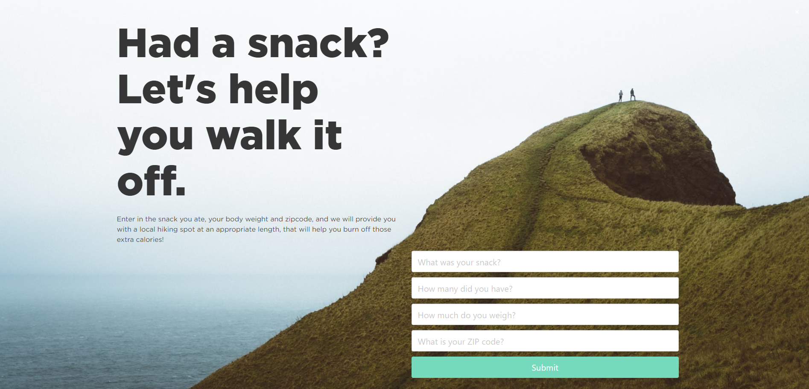
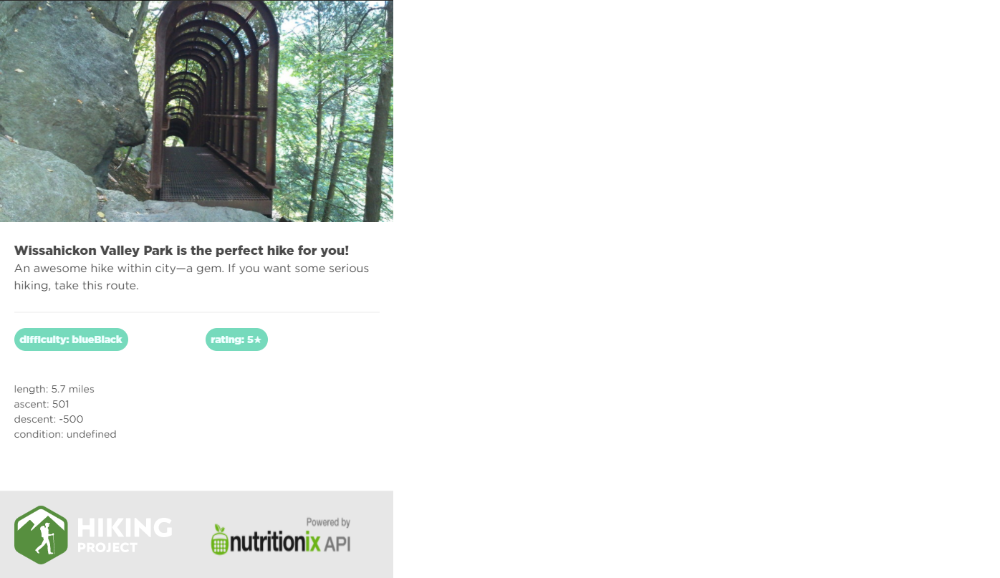

# Walk it Off

Project Description:
    We created an application that will offer an appropriate hike option for the user based on how many calories they want to burn off after having that extra snack they were craving. Let’s be honest, we all love food and sometimes we can’t help ourselves to seconds!

User Story:
    So you walk into a Dunkin Donuts, planning on just picking up your coffee for that morning, when you see the employee loading up the rack with freshly made jelly doughnuts. So you say, “what the heck, I’ll take a Jelly doughnut as well.” The cashier says to you “they just so happen to be 1 for a dollar but half a dozen for only \$2.”

    “Well, who can say no to that!” you respond…

    After demolishing a half a dozen jelly doughnuts for breakfast, you are filled with regret…. And jelly.
    Well then this app is for you.  We will help you determine a peaceful hike for the appropriate distance to BURN those calories away… like they never happened at all!

Usage:
    On the main webpage you should enter the snack that you ate, the quantity, your weight, and your zipcode. Then proceed to hit the submit button.

    You will then be prompted with a suggested hiking trail that is long enough to burn off the calories of whatever food you had to eat.

Credits:
    Project Developers:
        Ryan Seckman github:https://github.com/Rseckman
        Andrew Bretnall github:https://github.com/andbret
        Jared Bartynski github:https://github.com/JaredBartynski

    API list:
        nutritionix    https://www.nutritionix.com/
        OpenWeather    https://openweathermap.org/
        Hiking Project https://www.hikingproject.com/

MIT License
Copyright (c) [2000] [Ryan Seckman, Andrew Bretnall, Jared Bartynski]

    Permission is hereby granted, free of charge, to any person obtaining a copy
    of this software and associated documentation files (the "Software", to deal
    in the Software without restriction, including without limitation the rights
    to use, copy, modify, merge, publish, distribute, sublicense, and/or sell
    copies of the Software, and to permit persons to whom the Software is
    furnished to do so, subject to the following conditions:

    The above copyright notice and this permission notice shall be included in all
    copies or substantial portions of the Software.

    THE SOFTWARE IS PROVIDED "AS IS", WITHOUT WARRANTY OF ANY KIND, EXPRESS OR
    IMPLIED, INCLUDING BUT NOT LIMITED TO THE WARRANTIES OF MERCHANTABILITY,
    FITNESS FOR A PARTICULAR PURPOSE AND NONINFRINGEMENT. IN NO EVENT SHALL THE
    AUTHORS OR COPYRIGHT HOLDERS BE LIABLE FOR ANY CLAIM, DAMAGES OR OTHER
    LIABILITY, WHETHER IN AN ACTION OF CONTRACT, TORT OR OTHERWISE, ARISING FROM,
    OUT OF OR IN CONNECTION WITH THE SOFTWARE OR THE USE OR OTHER DEALINGS IN THE
    SOFTWARE.
